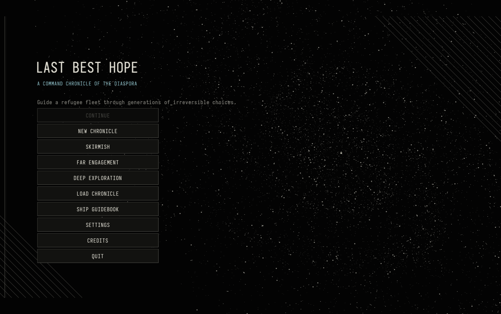

# Last Best Hope



**Last Best Hope** is a deterministic fleet chronicle in which persistent
starships become historical characters. The campaign alternates between the
Diaspora Fleet simulation and **Passage**, where task groups navigate a
continuous four-dimensional environment to answer institutional needs.

Its visual language is monochrome cosmic-horror engraving: persistent,
mechanically legible ships set against immense organic and architectural forms.
See [`docs/art-direction.md`](docs/art-direction.md) for the production rules.

## Implemented Passage

Passage uses deterministic continuous 4D topology, player-authored courses,
procedural correspondences, persistent ecology, institutional strategy learning,
and structured debriefs. Fleet stock is transferred into an expedition manifest;
unused stock returns only when the ships do. Discoveries remain local until a
fleet debrief or authenticated relay upload. See
[`docs/passage-expeditions.md`](docs/passage-expeditions.md) for the authoritative
contract.

## Build and run

Requirements:

- macOS on Apple Silicon or Intel, with Xcode command-line tools and Homebrew
- The sibling repository `../zelda-engine`

Bootstrap the pinned Odin and Slang compilers plus native dependencies, then
verify the complete environment:

```sh
./tools/bootstrap-macos.sh
make doctor
```

The bootstrap is explicit: normal build targets never install or update tools.
Downloaded compilers live under the ignored `.tools/` directory and are
verified against the SHA-256 digests in `toolchain.mk`. Running the bootstrap
again is safe. Override `ZELDA_ENGINE_ROOT` if the engine is elsewhere; local
builds require that checkout to exist but do not require a clean tree or a
particular commit.

```sh
make fmt
make check
make test-fast
make test
make run
build/dev/last-best-hope --combat
build/dev/last-best-hope --combat-stress
build/dev/last-best-hope --combat-finale
build/dev/last-best-hope --capture-planet build/planet.png 24301 ocean
build/dev/last-best-hope --capture-planet build/ringed.png 24301 gas-giant rings
build/dev/last-best-hope --capture-planet build/saturn.png 24301 saturn
build/dev/last-best-hope --capture-planet build/saturn-4k.png 24301 saturn 2560 1440
build/dev/last-best-hope --planet-preview 24301 fertile
build/dev/last-best-hope --planet-preview 24301 gas-giant rings
build/dev/last-best-hope --capture-star build/star.png 24301 main
build/dev/last-best-hope --capture-star build/star-t30.png 24301 main 30
build/dev/last-best-hope --capture-star build/star-reduced.png 24301 main 30 reduced
build/dev/last-best-hope --star-preview 24301 red-giant
```

`make build` produces the timestamp-aware development executable under
`build/dev/`. `make release` produces the measured optimized profile under
`build/release/`; `make profile-build` produces an optimized executable, compiler
timings, debug symbols, and a macOS dSYM under `build/profile/`. Tests use
`build/test/`. Repeating an unchanged build does not invoke Odin, Slang, the C
compiler, or asset copies.

`make clean` removes project-owned `build/` and `dist/` outputs. `make
clean-tools` separately removes downloaded pinned tools, which can be restored
with the bootstrap script.

`make test-fast` runs deterministic edit-time checks (about 90 seconds on the
reference development machine, including three package compilations).
`make test-balance` enforces sampled combat difficulty and pacing, while
`make test-generative` runs large seed sweeps, long-horizon simulations, and
ship-generation coverage. Add files containing statistical, soak, performance,
or large seed-sweep tests to the corresponding explicit list in the Makefile;
new unlisted tests join the fast suite. `make test` (or `make test-all`) runs
every package and reports failures from all three even if an earlier package
fails. Individual package suites are available as `make test-game`,
`make test-canvas`, and `make test-src`.

```sh
build/dev/last-best-hope --capture-ship-contact-sheet build/fleet-ships.png 24301 fleet
make demo
make passage
make bot
make simulate
make package
```

The planet capture mode creates a deterministic encyclopedia-etching plate from
a seed. Kinds are `rocky`, `fertile` (`ocean` is an alias), `ice`, `gas-giant`, and `ice-giant`; the
renderer derives the spherical terminator, limb atmosphere, surface structure,
clouds, and crosshatch density procedurally without source textures.
Pass `rings` after the kind to force a ring system. `--planet-preview` keeps the
plate open and rotates its surface slowly beneath fixed directional light;
rings remain in their orbital plane.
Optional width and height arguments after the kind (or `rings`) resize the
capture window for high-resolution output.

Ring systems are deterministically generated from the supplied seed. Their
inner and outer edges are expressed in planetary radii, with seeded optical
density, particulate variation, ring families, and divisions. Subpixel
ringlets converge to average optical density to avoid moire during animation.

Named Solar System presets are `mercury`, `venus`, `earth`, `mars`, `jupiter`,
`saturn`, `uranus`, and `neptune`. They preserve the monochrome engraving art
direction while matching the current renderer's available physical controls:
planet family, axial tilt, ocean and cloud coverage, atmosphere, banding,
oblateness, and rings. Surface geography remains seed-driven rather than a map.

The star renderer uses the same deterministic procedural engraving pipeline.
Kinds are `main`, `red-giant`, `blue-giant`, `white-dwarf`, and `neutron`.
A coarse dynamic texture carries a deterministic 4 Hz surface simulation:
signed magnetic flux follows differential rotation, meridional transport, and
diffusion, while a coupled photospheric temperature field follows advection,
thermal diffusion, radiative relaxation, buoyant plume emergence, and magnetic
quenching. Spots, faculae, convection relief, and prominence footpoints derive
from that shared history while preserving black negative space.
Stellar color is derived from effective temperature using a restrained
blackbody approximation: cool stars shift warm, hot stars shift blue-white,
and Sun-like stars remain nearly white rather than becoming saturated yellow.
Close-up stars also accept luminosity, mass, radius, deterministic time, and
rotation rate. Main-sequence stars, giants, white dwarfs, and neutron stars use
distinct surface and magnetosphere models; eight curved engraving bands follow
the evolving convection field instead of forming a screen-space grid.
Frames containing a close-up star are rendered to a lazily allocated
`RGBA16F` scene target. A thresholded multi-scale image convolution produces
bloom before an ACES-style tone-map pass composites to the swapchain; all
other canvas frames retain the original direct rendering path.
Optional capture arguments after the class specify deterministic simulation
time in seconds and the literal `reduced`. Reduced motion ignores supplied
evolution time and rotation, producing the same frozen seeded plate.

`make run` launches the graphical Command Chronicle interface. It includes
civilization creation, the Fleet constellation and dossiers, Chronicle and
Build workspaces, expedition commissioning, the Passage star chart, structured
debrief, endings, settings, and autosave recovery. Existing command-line demo,
interactive Passage, and simulation modes remain available for diagnostics.

Choose **Ship Generator** on the main menu to inspect deterministic procedural
strike, fleet, and habitat/utility frames. Drag to orbit and use the mouse wheel
to zoom. The contact-sheet command generates four consecutive construction
seeds from one family in three-quarter, top, and side views; optional width and
height arguments follow the family name and default to 3000×2400.

The ship-generator benchmark renders one complete detailed generator view at an
exact 3840×2160 framebuffer, with 20 warmup frames and CPU, wall-frame, and GPU
timestamp summaries against 8 ms CPU-p95 and 16.67 ms frame-p95 budgets:

```sh
VIZZA_GPU_PROFILER=1 ./build/profile/last-best-hope --benchmark-ship-gen 180 24301 fleet
```

The isolated 4K ship-hatching harness covers a merged flat-fill baseline,
merged one- and four-layer engraving, and four-layer engraving with per-face
configuration changes that force the same batch churn as generated surfaces:

```sh
VIZZA_GPU_PROFILER=1 ./build/profile/last-best-hope --benchmark-ship-hatching 180
```

The desktop host uses SDL3 with the product-neutral `zelda-engine` Vulkan
context, render-resource uploads, renderer-neutral UI text shaping, and a
Slang-to-SPIR-V UI pipeline adapted from Zelda's Storytelling Game. Raylib is
not used.

Choose **Fleet Operation** on the main menu for the playable **Recover the
Seedship** 3D fleet-tactics prototype. See
[`docs/close-engagement.md`](docs/close-engagement.md) for controls and architecture.


`make package` builds a native distributable for the current host. On macOS it
creates `dist/Last Best Hope.app` with the application icon embedded; on Linux
it creates `dist/last-best-hope-linux.tar.gz` with the 1024 px icon alongside
the executable. Cross-platform icon masters, including a Windows `.ico`, live
in `assets/icons`.

`make demo` runs a deterministic continuous-Dark mapping voyage for seed `0x5eed`, including material-pause replanning, a permanent door discovery, mixed-domain return, debrief, and sponsor evidence.

Chronicles are open-ended. Seasons have no fixed cap; play ends when the player
concludes the chronicle or when no traveling fleet remains.

`make passage` starts an interactive expedition. The briefing selects a procedural purpose, persistent ships, and the five independent strategy dimensions. During the voyage you author 4D course legs, respond to coherence and ecological pauses, cross stable correspondences, service relays, and declare completion at a safe endpoint. Interstellar travel uses mapped Outer Dark correspondences; local fleet navigation consumes physical Propellant.

## Agent play-and-report interface

`make agent` starts a line-delimited JSON protocol on standard input and output.
It is intended for an external agent that needs to observe only player-visible
state and act without the graphical shell. Every response is one JSON object.
Diagnostics do not share stdout.

Start a seeded expedition with either one of all 162 indexed profiles or explicit independent strategy dimensions:

```json
{"command":"start","seed":24301,"ships":[0,1],"ship_count":2,"has_strategy":true,"depth_posture":1,"course_priority":2,"ecology_posture":0,"relay_posture":1,"withdrawal_margin":0}
```

Responses report phase, domain, pause reason, sponsor recommendation, selected and recommended profiles, evidence, differences, and known failure modes. Send one action at a time, such as `set_strategy`, `course_to_door`, `custom_course`, `cross_door`, `normal_course`, `enter_dark`, `service_relay`, `fleet_endpoint`, `relay_endpoint`, `conclude`, or `declare_missing`:

Protocol version 5 also reports authoritative fleet stock, protected operating
floors, spendable stock, principal exposure, and the expedition manifest's
allocated, consumed, recovered, and lost resources.

```json
{"command":"act","action":"course_to_door","depth":2.5}
{"command":"act","action":"advance"}
{"command":"act","action":"cross_door"}
{"command":"act","action":"enter_dark","door_id":1}
```

`observe` repeats the current player-facing state without consuming randomness.
The protocol does not expose undiscovered topology or untransmitted institutional
knowledge.

### Complete campaign runs

The same protocol can also play a complete Chronicle through the deterministic
campaign policy used for headless playtests. This covers civilization founding,
seasonal needs, political and settlement decisions, fleet navigation, Passage,
combat, recoverable failures, and endings. Supply the policy profile, campaign
length, story tempo, and optional reporting horizon as integer enum values:

```json
{"command":"campaign","seed":24301,"campaign_profile":0,"campaign_length":1,"campaign_tempo":0,"campaign_horizon":24}
```

Profiles are `0=strategist`, `1=steward`, `2=explorer`, `3=risk-manager`, and
`4=world-builder`; lengths are `0=short`, `1=standard`, `2=long`, and `3=open`;
tempos are `0=measured`, `1=spacious`, and `2=volatile`. The terminal
`campaign_result` includes the ending, outcome quality, seasons, passages,
objectives, player actions, invalid actions, ship losses and settlements,
rescues, emergency events, and final fleet stock. Agent policy randomness uses
a separate deterministic seed, so replaying the same request reproduces both
the campaign and its choices without perturbing simulation randomness.

## Headless simulation bots

The headless runner plays complete seeded campaigns with a separate deterministic policy RNG, so bot choices never consume or perturb the game simulation's random sequence. Five weighted profiles model the primary player stories:

- `strategist`: constrained planning, objective completion, efficient task groups, and resource tradeoffs
- `steward`: rescues, promises, communities, ships, and accumulated history
- `explorer`: uncertain routes, surveys, civilizations, discoveries, and voluntary deep paths
- `risk-manager`: return reserves, ship preservation, bounded danger, and timely withdrawal
- `world-builder`: identity, cohesion, precedents, colony preparation, and settlement futures

Run one profile or compare all five:

```sh
build/release/last-best-hope --simulate 1000 strategist
build/release/last-best-hope --simulate 1000 all
build/release/last-best-hope --simulate 1000 all --csv > runs.csv
build/release/last-best-hope --habitability 100000 evidence-centered 24301
```

Profile deterministic campaign throughput with matched seeds and per-phase CPU
timings. The default three repetitions retain median throughput and tail latency;
progress is written to stderr and the final machine-readable result to stdout:

```sh
make release
build/release/last-best-hope --benchmark-campaigns 100 strategist measured 24301 24 3 3
make profile-build
```

Arguments after tempo are seed, horizon in seasons, warmup campaigns, and
repetitions. Compare only identical configurations on the same machine. The
checked-in 250 ms campaign p95 target is intentionally strict; a relative
change inside 5% is treated as noise. Accept a machine baseline only from an
otherwise idle system.

## Galaxy rendering benchmark

The graphical runner includes a deterministic galaxy-map benchmark covering
wide, mid, and close zooms. Each scenario receives 20 warmup frames followed by
the requested number of samples (60–900):

```sh
VIZZA_GPU_PROFILER=1 ./build/profile/last-best-hope --benchmark-galaxy 180 2
```

The final argument is the campaign seed. Output is JSON Lines with median, p95,
and maximum CPU draw-construction time; GPU frame time is included when Vulkan
timestamp queries are available and otherwise reported as `null`. The current
1280×720 M4 Max CPU p95 budget is 14 ms per scenario. Compare runs only when
resolution, hardware, seed, sample count, and build configuration match.

The close-up stellar benchmark exercises the complete HDR scene, procedural
photosphere, low-rate magnetic-flux uploads, bloom, and filmic composite. Its
arguments are sample count, seed, and stellar class:

```sh
VIZZA_GPU_PROFILER=1 ./build/profile/last-best-hope --benchmark-star 180 24301 main
```

Supported fixtures are `main`, `red-giant`, `blue-giant`, `white-dwarf`, and
`neutron`. The animation advances on a deterministic 60 Hz clock after 20
warmup frames. Output reports CPU wall-frame and GPU whole-frame median, p95,
and maximum times against the 16.67 ms frame budget.
The checked-in matched-run baseline is
[`docs/performance/star-renderer-baseline.json`](docs/performance/star-renderer-baseline.json).

The planet-detail benchmark renders the complete celestial survey modal with a
deterministically selected cloud-bearing planet. It advances atmosphere time at
60 Hz, warms up for 20 frames, and reports total CPU frame construction,
atmosphere simulation/upload CPU time, and GPU whole-frame time:

```sh
VIZZA_GPU_PROFILER=1 ./build/profile/last-best-hope --benchmark-planet-detail 180 24301
```

The M4 Max 1280×720 budgets are 8 ms CPU p95, 1 ms atmosphere CPU p95, and
16.67 ms GPU p95. Relative comparisons require identical seed, sample count,
resolution, hardware, and build configuration.

The matching star-detail benchmark uses the same complete survey modal and
sample clock at an exact 3840×2160 framebuffer (without a platform HiDPI
multiplier), with 8 ms CPU and 16.67 ms GPU p95 budgets:

```sh
VIZZA_GPU_PROFILER=1 ./build/profile/last-best-hope --benchmark-star-detail 180 24301
```

For runtime profiler captures, build a separate optimized binary with DWARF
symbols and run the identical scenario through it:

```sh
make profile-build
VIZZA_GPU_PROFILER=1 ./build/profile/last-best-hope --benchmark-planet-detail 180 24301
```

The profile target preserves the development executable and, on macOS, emits a
matching `.dSYM` bundle for Instruments.

The continuous-Dark renderer has a matched fixture using the same warmup,
sampling, GPU timestamp, and 1280×720 frame budgets:

```sh
VIZZA_GPU_PROFILER=1 ./build/profile/last-best-hope --benchmark-passage-render 180 24301
```

For detailed graphics-pass timing on macOS, capture the same executable with
the Instruments **Metal System Trace** template. The Vulkan command stream is
labelled as `UI Geometry`, with nested ordinary, planet, star, volume, graph,
and Gaussian draws. The **Logging** template exposes matching CPU intervals for
buffer upload, command setup, and every draw category under the `GFX`
subsystem. GPU timestamp queries additionally report the complete UI geometry
pass when the Vulkan device supports them; MoltenVK may report them unavailable.

```sh
xcrun xctrace record --template 'Metal System Trace' \
  --output /tmp/planet-detail-metal.trace \
  --env ZELDA_CANVAS_GFX_DETAILED_PROFILE=1 \
  --env VIZZA_GPU_PROFILER=1 \
  --launch -- ./build/profile/last-best-hope \
  --benchmark-planet-detail 180 24301
```

Set `ZELDA_CANVAS_GFX_DETAILED_PROFILE=1` for either Metal System Trace or Logging
captures. Without it, the renderer emits only the low-overhead frame/pass
signposts used by ordinary profiling builds.

The deterministic 4D creature gallery renders five evolved genomes across
three W slices. It is the visual regression fixture for silhouette variety,
exposed anatomy, and meaningful fourth-axis transformation:

```sh
odin run tools/creature_gallery \
  -collection:zelda_engine=../zelda-engine/packages -- \
  /tmp/creature-gallery.ppm 404
```

For repeatable CPU profiling, compile the tool once with `-o:speed`, then run
the resulting binary at least three times. Its final JSON line separates seeded
evolution from contact-sheet rendering and reports render time per panel. The
absolute targets are recorded in
[`docs/performance/creature-render-budget.json`](docs/performance/creature-render-budget.json).

The terminal summary includes win and objective rates, losses, rescues, invalid-action diagnostics, and an ending-distribution graph. CSV mode emits one row per reproducible run for external analysis.

## Project layout

- `packages/game`: deterministic Fleet and Passage state, rules, history, persistence, and tests
- `src`: executable and terminal presentation policy
- [`docs`](docs/README.md): canonical product, simulation, presentation, and
  validation contracts
- `../zelda-engine/packages`: product-neutral engine dependencies

Documentation scope and maintenance rules are in
[`docs/README.md`](docs/README.md).
## Compiler and finale profiling

Development builds use `-debug -o:minimal`. The graphical entry-point orchestration is
an explicit unoptimized boundary because sending its full control-flow graph
through LLVM caused excessive compiler time and memory growth; simulation and
rendering procedures remain optimized. Run `make profile-build` to build without
launching the game and write the compiler phase report to
`build/profile/timings/compiler.json`. Override `PROFILE_ODIN_FLAGS` when
investigating code generation separately from optimization.

Build the isolated fleet-finale profiler with:

```sh
odin build tools/combat_finale_profile \
  -collection:zelda_engine=../zelda-engine/packages \
  -out:/tmp/combat-finale-profile -o:minimal
/tmp/combat-finale-profile 180 24301
```

This executable excludes the graphical package, runs the deterministic
2,200-ship simulation, and reports tick p95/max plus exact roster bytes as JSON.
